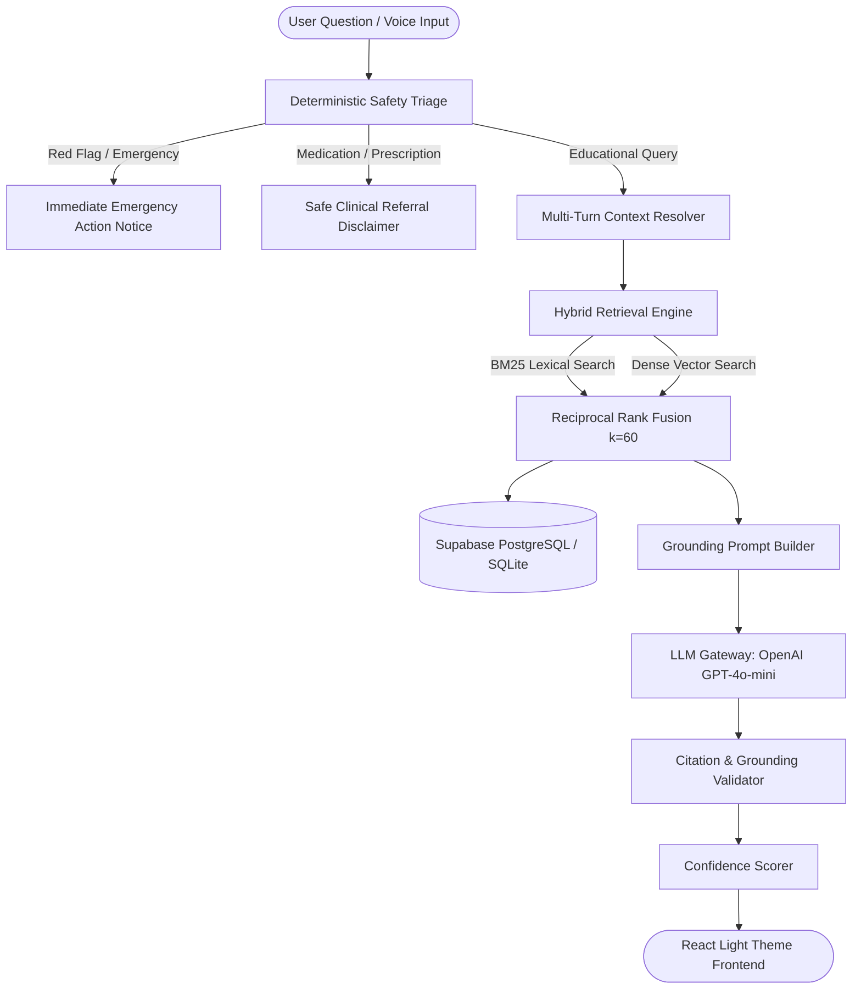

# HealthEvidence — Healthcare LLM + RAG Assistant

<div align="center">

[](https://heathcare-chatbot-2.onrender.com/)
[](https://fastapi.tiangolo.com)
[](https://reactjs.org/)
[](https://tailwindcss.com/)
[](https://supabase.com/)
[](https://openai.com/)
[](https://docs.pytest.org/)

### 🌐 **Live Web Application**: [https://heathcare-chatbot-2.onrender.com/](https://heathcare-chatbot-2.onrender.com/)

*Evidence-Grounded Healthcare Information & Health Literacy Assistant with Strict Safety Guardrails.*

</div>

---

> [!IMPORTANT]
> **Safety Boundary & Disclaimer:** HealthEvidence provides health literacy information grounded exclusively in verified public-health publications (WHO, CDC, ICMR, NIH MedlinePlus). It is **not** a diagnostic device, emergency triage service, prescribing tool, or a substitute for licensed medical advice. In emergencies, call **112 (India)**, **911 (US)**, or **999 (UK)** immediately.

---

## 🌟 Key Capabilities

1. **Deterministic Safety Triage Gate:**
   - Evaluates all inbound queries for red flags (chest pain, stroke symptoms, loss of consciousness, severe trauma, self-harm crisis) and prohibited requests (diagnosis demands, medication prescription/dosing).
   - Routes critical inputs instantly to emergency guidance with 100% recall—zero LLM generation or retrieval latency.

2. **Hybrid Lexical + Vector Retrieval:**
   - Integrates BM25 keyword matching with dense TF-IDF and vector semantic search.
   - Merges results via **Reciprocal Rank Fusion (RRF $k=60$)** and cross-scoring reranking for high precision and source diversity.

3. **Strict Grounding & Inline Citations:**
   - Every factual claim is validated against retrieved evidence and cited using clickable `[S1]`, `[S2]` badges.
   - Slide-out **Source Drawer** allows instant inspection of verified publication text excerpts, publication dates, and registry authorities.

4. **Multi-Turn Conversational Resolution:**
   - Resolves follow-up pronouns, ellipses, and subjectless medical queries (*"What foods should I avoid with it?"* $\rightarrow$ *"What foods should I avoid with hypertension?"*).

5. **Built-in 24/7 Uptime Keep-Alive Bot:**
   - Automated background service that periodically pings the health endpoint, preventing cold-start sleeps on free/starter cloud tiers (Render, Railway, Fly.io).

6. **Interactive Multi-Modal Features:**
   - **Voice Input:** Web Speech API dictation (`Mic` toggle).
   - **Text-to-Speech:** Integrated voice playback with animated soundwave audio indicator.
   - **Transcript Export:** One-click Markdown export of consultation history.
   - **Session History:** Date-grouped session sidebar ("Today", "Yesterday", "Previous 7 Days") with renaming and deletion.

---

## 🏗️ System Architecture



---

## 🚀 Live Deployment & Cloud Setup

### 🔗 Live URLs
- **Production Web App:** [https://heathcare-chatbot-2.onrender.com/](https://heathcare-chatbot-2.onrender.com/)
- **API Health Endpoint:** [https://heathcare-chatbot-2.onrender.com/api/v1/health](https://heathcare-chatbot-2.onrender.com/api/v1/health)
- **Interactive OpenAPI Docs:** [https://heathcare-chatbot-2.onrender.com/api/v1/docs](https://heathcare-chatbot-2.onrender.com/api/v1/docs)

---

## 💻 Local Development Setup

### Prerequisites
- Python 3.11+
- Node.js 20+

### 1. Backend Setup
```bash
# Install Python requirements
pip install -r requirements.txt

# Run database migrations and seed verified medical documents
python scripts/seed_sources.py
python scripts/ingest_directory.py

# Launch FastAPI development server
uvicorn backend.app.main:app --reload --port 8000
```

### 2. Frontend Setup
```bash
# In frontend directory
cd frontend
npm install
npm run dev
```
Open **`http://localhost:5173`** in your browser.

---

## 🐳 Docker & Production Deployment

### Single-Container Production Run
```bash
# Build and run with Docker Compose
docker compose up --build -d
```
The app will be live at `http://localhost:8000`.

### Production One-Click Scripts
- **Windows:** Run `start_production.bat`
- **Linux / Cloud:** Run `./start_production.sh`

---

## 🧪 Test Suite & Safety Benchmarks

Run the complete 19-suite test suite:
```bash
python -m pytest backend/tests -v
```

Run safety & retrieval benchmarks:
```bash
# Safety triage benchmark
python scripts/evaluate_safety.py

# Retrieval performance benchmark (Recall@5, Recall@10, MRR)
python scripts/evaluate_retrieval.py
```

---

## 📡 API Reference

| Method | Endpoint | Description |
|---|---|---|
| `POST` | `/api/v1/chat` | Main conversational query & grounded RAG synthesis |
| `GET` | `/api/v1/sources` | List all verified health registries & documents |
| `GET` | `/api/v1/sessions` | Fetch session conversation history |
| `POST` | `/api/v1/sessions` | Create a new consultation session |
| `POST` | `/api/v1/feedback` | Submit clinical feedback / issue reports |
| `GET` | `/api/v1/health` | Service health status & index readiness |

---

## 🤖 24/7 Uptime Keep-Alive Bot Configuration

The application includes an internal background keep-alive task (`backend/app/services/uptime_service.py`) that pings itself every 10 minutes to prevent cold-start sleeps on free hosting tiers.

Configurable in `.env` / environment variables:
```env
UPTIME_BOT_ENABLED=true
UPTIME_PING_URL=https://heathcare-chatbot-2.onrender.com/api/v1/health
UPTIME_PING_INTERVAL_MINUTES=10
```

---

## 📜 License
MIT License. Copyright (c) 2026 Healthcare LLM + RAG Assistant Team.
